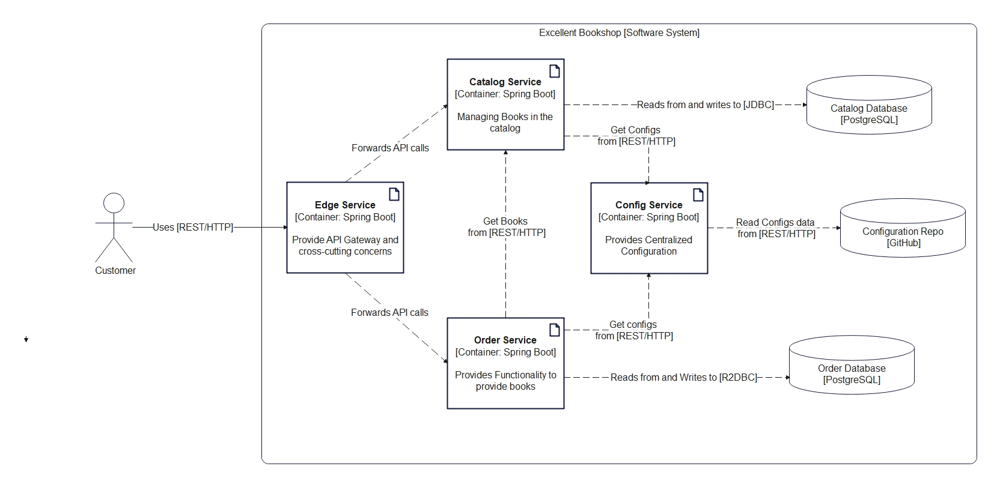

# Excellent Book Shop

Excellent BookShop is a Cloud Native Application with Spring Boot and Kubernetes.



- [Order Service](https://github.com/chiskien/excellent-order-service)
- [Deployment](https://github.com/chiskien/excellent-deployment)
- [Edge Service](https://github.com/chiskien/excellent-edge-service)
- [Config Service](https://github.com/chiskien/config-service)

# Patterns and Technologies

- [12 Factors and Beyond Practices and Patterns](https://architecturenotes.co/12-factor-app-revisited/)
- Service-based Architecture

## Web and Interactions

- RESTFul web services using Spring MVC (blocking I/O, synchronous)
- Spring WebFlux / Reacting Programming (non-blocking I/O, asynchronous)

## Data

- PostgresSQL: relational database for permanently store data
- Spring Data JDBC (imperative)
- Spring Data R2DBC (reactive)
- Flyway: evolve data source and manage schema migrations
- Redis, Spring Session: externalize the session storage
- Docker: containerize application

## Configuration

- Using External Configuration
- Spring Cloud Config

## Use cases:

### Excellent Bookshop (Catalog Service):

- View the list of books in the catalog
- Search books by their ISBN (International Standard Book Number)
- Add a new book to the catalog
- Edit information for an existing book
- Remove a book from the catalog

### [Order Service](https://github.com/chiskien/excellent-order-service)

- Submit an Orders
- Get Book detail from Excellent-BookShop

## Commands: (if don't use docker compose)

- Create a network within Docker (because Docker built-in has a DNS Server)

```shell
docker network create catalog-network
```

- Create a `postgres` container applying network inside container

```shell
docker run -d --name excellent-postgres --net excellent-network -e POSTGRES_USER=<user> -e POSTGRES_PASSWORD=<password>
-e POSTGRES_DB=polardb_catalog -p 5432:5432 postgres:15.3
```

- Create JAR

```shell
./mvnw clean install
```

- Build `excellent-bookshop` image

```shell
docker build -t excellent-bookshop .

```

- Run Application with Docker

```shell
docker run --rm --name excellent-bookshop --net excellent-network -p 9001:9001
-e SPRING_DATASOURCE_URL=jdbc:postgresql://excllent-postgres:5432/polardb_catalog
-e SPRING_PROFILES_ACTIVE=demo excellent-bookshop

```

- Instead of `localhost:5432`, we replace with `excellent-postgres` (the name of container we created above)
- Activate `demo` profile with dummy data.
