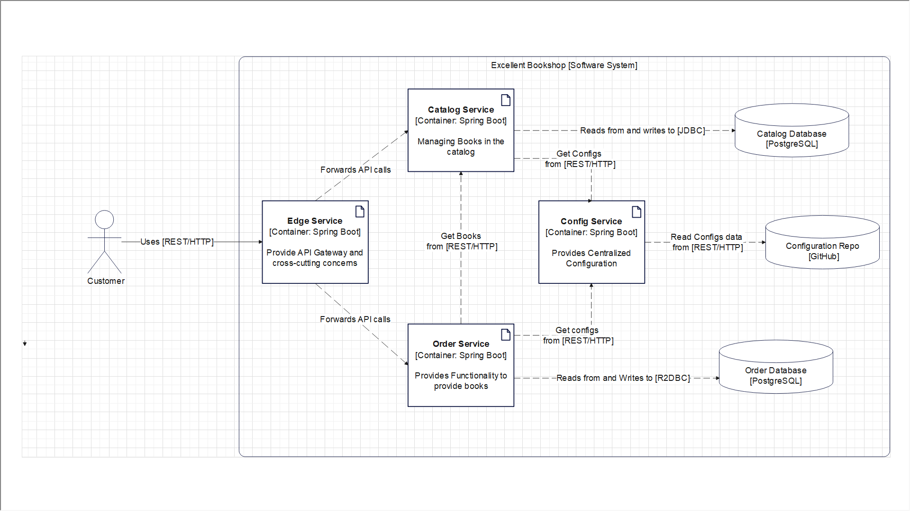

# Excellent Book Shop

Excellent BookShop is a Cloud Native Application with Spring Boot and Kubernetes.

## Systems:

- [Order Service](https://github.com/chiskien/excellent-order-service)
- [Deployment](https://github.com/chiskien/excellent-deployment)
- [Edge Service](https://github.com/chiskien/excellent-edge-service)
- [Config Service](https://github.com/chiskien/config-service)

# Properties of Cloud Native Applications

### Scalability:

### Loose Coupling

### **Resilience**

### **Manageability**

### **Observability**

# Use cases:

### Catalog Service:

- View the list of books in the catalog
- Search books by their ISBN (International Standard Book Number)
- Add a new book to the catalog
- Edit information for an existing book
- Remove a book from the catalog

### [Order Service](https://github.com/chiskien/excellent-order-service)

- Submit an Orders
- Get Book detail from Excellent Catalog Service

### [Edge Service]

- Authenticate and Authorize user
- Provide API Gateway and handling cross-cutting concerns

### [Config Service]()

- Fetch configurations from a repository
- Third Party Config Server

### [Dispatcher Service]

# Patterns and Technologies

- [12 Factors and Beyond Practices and Patterns](https://architecturenotes.co/12-factor-app-revisited/)
- Service-based Architecture

## Web and Interactions

- RESTFul web services using Spring MVC (blocking I/O, synchronous)
- Spring WebFlux / Reacting Programming (non-blocking I/O, asynchronous)

## Data

- PostgresSQL: relational database for permanently store data
- Spring Data JDBC (imperative)
- Spring Data R2DBC (reactive)
- Flyway: evolve a data source and manage schema migrations
- Redis, Spring Session: externalize the session storage
- Docker: containerize application

## Kubernetes

- [Minikube](https://minikube.sigs.k8s.io/docs/): Local K8s Cluster
- [Tilt](https://tilt.dev/): An open-source tools for automate k8s workflow
- [Octant](https://octant.dev/): Visualize K8s workloads
- [Kubeval](https://www.kubeval.com/): Validating K8s YAML Manifests.

## Configuration

- Using External Configuration
- Spring Cloud Config

